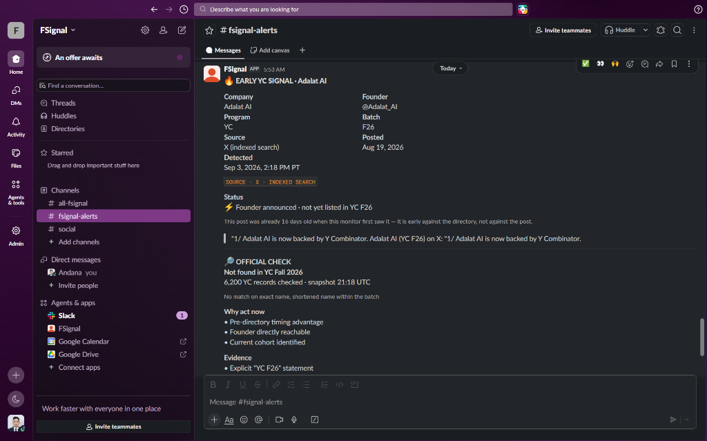
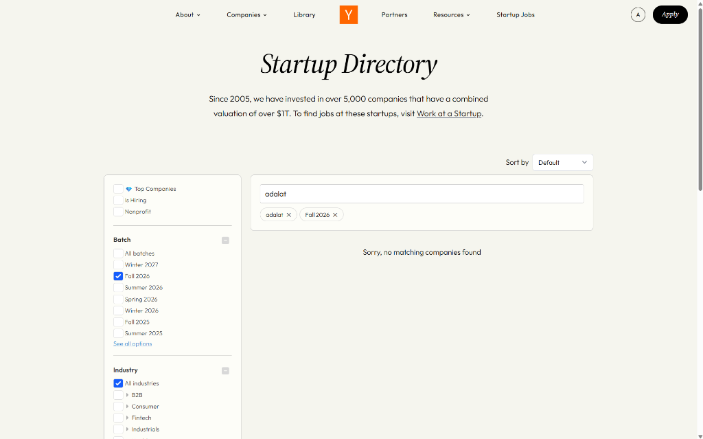

# FSignal

**[🚀 VIEW LIVE DASHBOARD (FSignal Radar)](https://fsignal-production.up.railway.app)**


A persistent Slack monitor that finds Y Combinator and a16z Speedrun founders **before
the official directory lists them** — and proves the claim on every alert.

A normal directory watcher tells you what has already been published. FSignal is built
around the earlier moment: the founder has announced acceptance publicly, but the
directory has not caught up. The hard part is not finding posts that mention YC; it is
knowing which of them are genuinely early. So every EARLY alert carries a receipt:

> 🔎 **OFFICIAL CHECK**
> **Not found in YC Fall 2026**
> 6,199 YC records checked · snapshot 17:14 UTC
> *No match on exact name, shortened name within the batch*

Every alert links straight to the directory search that proves it, so you can check it yourself in about ten seconds. Everything the bot rejects
is recorded too, with a reason — see `/ledger`.


## Proof of Functionality

FSignal successfully intercepts real Ghost Signals before they are listed in the official directory.


*A real-time Slack alert from FSignal catching an early founder announcement.*


*FSignal details the pre-directory timing advantage and provides direct evidence links.*


*Simultaneous search on the official YC Directory confirms the company is not yet listed, validating the Early Signal detection.*

## How it works

```text
YC Directory ─┐
Speedrun ─────┴─→ complete official snapshot (size + timestamp)
                            │
X / LinkedIn ──→ identity gate ──→ scoring ──→ official check ──→ EARLY / already-listed
                     │                              │                    │
              suppression ledger              persisted receipt      Slack alert
                                                                          │
                            company later appears officially → CONFIRMED + lead time
```

**Official snapshot.** `ycombinator.com/companies` is a client-side Algolia application;
FSignal uses the same public search key the page hands its own JavaScript. A single
Algolia query caps at 1,000 hits, so a full crawl enumerates the `batch` facet and pulls
one slice per batch — **6,200 of 6,200 companies in about 8 seconds**. Between full
crawls, one recent-window query against the launch-date index catches new listings.
Speedrun uses a16z's own first-party API, the one `speedrun.a16z.com` calls itself.

> **On "YC Speedrun".** The brief names a *YC* Speedrun page. There is no such program:
> the public, distinct Speedrun company directory is **a16z Speedrun**, and that is what
> FSignal monitors — as a separate source, on its own schedule, with its own
> `SPEEDRUN` badge on every alert, exactly as the brief asks. It is tagged a16z rather
> than YC because that is who runs it, not because a source was substituted.

**Targeting.** Search terms are derived from whichever batches the directory reports as
currently filling, not hardcoded. A batch that is fully published cannot produce an early
signal, so hunting one is worse than not hunting. When Winter 2027 opens, the queries
retarget with no code change.

**Identity gate.** A candidate must yield a defensible company identity — a parenthesised
program tag like `Orca Aerospace (YC F26)`, a claim like `Structured AI is backed by Y
Combinator`, or `our company <Name>` — and survive a disqualifying-context check
(application deadlines, rejection posts, demo-day recaps, alumni threads, recruiter posts,
investor commentary). Anything that fails is ledgered with a reason and never alerted.

**Official check.** Domain first, then exact normalized name, then a batch-scoped strict
token-prefix so `Nodus` resolves to `Nodus Compute` while `Shepherd (YC S26)` does not
match the unrelated `Shepherd (Winter 2021)`. Last, a batch-scoped handle comparison,
because X names companies by handle: `@speko_ai` is the directory's `Speko`, and comparing
those as *names* says they are different companies — which is how an already-listed company
gets announced as an early discovery. Never fuzzy similarity, and both the prefix and
handle rules are confined to the batch the post itself claims, so neither can reach across
cohorts. If the snapshot is stale, the verdict is `possible`, never `early`.

**Dedup.** One alert per company, not per post. A second independent source for the same
company replies in the original Slack thread as corroboration.

## Measured behaviour

### How early is "early"?

The product is judged on lead time, so it is measured rather than asserted. A backtest
replays the live queries, extraction and matching against YC's *own published*
`launched_at`, for the batches the monitor is currently hunting
([`evidence/raw/lead-time-backtest.json`](evidence/raw/lead-time-backtest.json)):

| | |
|---|---|
| Companies resolved to a published listing time | 17 |
| Founder posted **before** YC listed them | 10 |
| Median lead | **4.4 days** |
| Mean lead | 15.3 days |
| Longest lead | **50 days** (screenpipe) |
| Ahead by a week or more | 5 |

The other 7 posted *after* YC listed them; they are reported, not averaged away. The
search index dates posts to the day, so each figure is ±1 day, and ranking means this is
a sample of the posts that existed rather than all of them. Both caveats are recorded in
the artifact itself.

### Precision

On 139 real captured Serper results for public LinkedIn posts
(`tests/fixtures/linkedin_corpus.json`, replayable offline):

| | |
|---|---|
| Candidates evaluated | 139 |
| Suppressed, each with a reason code | 106 |
| Correctly identified as already listed | 30 |
| Alerts raised | 3 |
| Alerts naming a real company | 3 / 3 |

`tests/test_precision.py` enforces precision ≥ 90% and a noise budget of at most one
non-actionable alert per twenty, in CI, against that fixture.

## Setup

> **New to Python or the terminal? Read [`docs/INSTALL.md`](docs/INSTALL.md) instead.**
> Same result, every click spelled out, Windows and macOS both covered, with a
> troubleshooting table keyed to the exact errors you might hit.

Requires Python 3.12+ (or Docker) and a Slack workspace where you can install an app.
Two credentials are enough to run everything: a Slack bot token and a Serper key.

```bash
python -m venv .venv && source .venv/bin/activate   # Windows: .venv\Scripts\activate
pip install -r requirements.txt
cp .env.example .env          # three lines marked >>> REQUIRED <<<
python -m uvicorn app.main:app --port 8000
```

Or `docker compose up -d`, which mounts `./data` so state survives restarts.

### Slack (required)

1. Create an app at [api.slack.com/apps](https://api.slack.com/apps) — you can upload
   `slack-app-manifest.yml` directly.
2. **OAuth & Permissions** → add the `chat:write` bot scope → install to your workspace.
3. Invite the bot to your channel: `/invite @FSignal`.
4. Copy the channel ID (right-click the channel → View channel details) and the bot token
   (`xoxb-…`) into `SLACK_CHANNEL_ID` and `SLACK_BOT_TOKEN`.

### Search provider (required)

Neither X nor LinkedIn offers unrestricted public post search on a free plan, so both
social sources read *publicly indexed* URLs through [Serper](https://serper.dev) rather
than scraping authenticated pages. Create a key and set `SERPER_API_KEY`; the free tier is
enough. Results cap at 10 per query, which is why the bot issues one query per active
batch rather than one combined query.

*Want it faster than the shipped 4-hour social cadence?* The directories already run
hourly; the founder-post half is limited by the search index, not by the polling. The
three tiers that close that gap — and the one that is impossible — are set out in
[`docs/ROADMAP.md`](docs/ROADMAP.md#getting-to-real-time).

### X (optional — improves the X source, does not enable it)

X's own recent search carries metadata indexed search cannot: author bio, profile URL, and
the exact post timestamp. FSignal prefers it whenever it is reachable. **It is not on the
free tier** — without a paid plan the API answers `402 credits depleted`.

So the X source has two paths. Native first; on a billing block or a missing token, the
same vocabulary runs against indexed public X URLs using the Serper key above. Which path
answered is never hidden: `/health` reports `mode` per source, the mode is persisted on
every signal, and Slack renders `Source: X (indexed search)` when the alert came from the
fallback. An indexed result is never presented as a native one.

Set `X_BEARER_TOKEN` if you have a paid plan. Leave it empty otherwise — the source works
either way.

### Pond (optional)

Set `POND_ACCESS_KEY` and `PUBLIC_BASE_URL` on a public HTTPS deployment, then publish the
agent with that base URL. See `docs/POND.md`.

## Verifying it works

```bash
python scripts/preflight.py     # which credentials are still missing
pytest -q                       # full suite, no credentials needed
python scripts/scan_once.py     # one real scan against live sources
python scripts/send_test_alert.py   # one real Slack message
```

Then open `/health` (source health, snapshot sizes, ledger counts), `/ledger` (every
candidate and its verdict), and `/signals/{id}/timeline` (one signal's full history).

### Offline rehearsal

```bash
python scripts/demo_seed.py
python scripts/replay_corpus.py
python scripts/demo_server.py
```

This replays the real captured corpus through the unmodified production pipeline — no
hand-fed identities and no invented timestamps. It is a rehearsal, not proof of live
delivery; for that, see `evidence/`.

## Adding a source

A source needs a `name` and an async `collect()`. Nothing else changes — extraction,
scoring, matching, persistence, dedup, Slack and Pond all sit downstream of that boundary.
See `docs/ARCHITECTURE.md`.

## Known limitations

- **Polling, not push.** Latency is bounded by the polling interval; there is no webhook.
- **LinkedIn is index-limited.** Discovery depends on Google having indexed the post, so
  the true lead time is worse than X's would be. Serper's free tier returns 10 results per
  query.
- **X requires a paid plan.** See above.
- **X recent search only reaches back 7 days.** An outage longer than that leaves a gap
  the `since_id` watermark cannot recover.
- **SQLite, single worker.** The scheduler is process-local, so run one uvicorn worker and
  keep the database on persistent storage. Postgres is the upgrade path, not a need here.
- **The identity gate prefers precision.** Announcements that name no company ("we got
  into YC!") are recorded as suppressed rather than alerted. That is deliberate.

## Security

`.env` is gitignored and excluded from the Docker build context; the image never contains
it. Rotate any credential that has been in a working tree.
