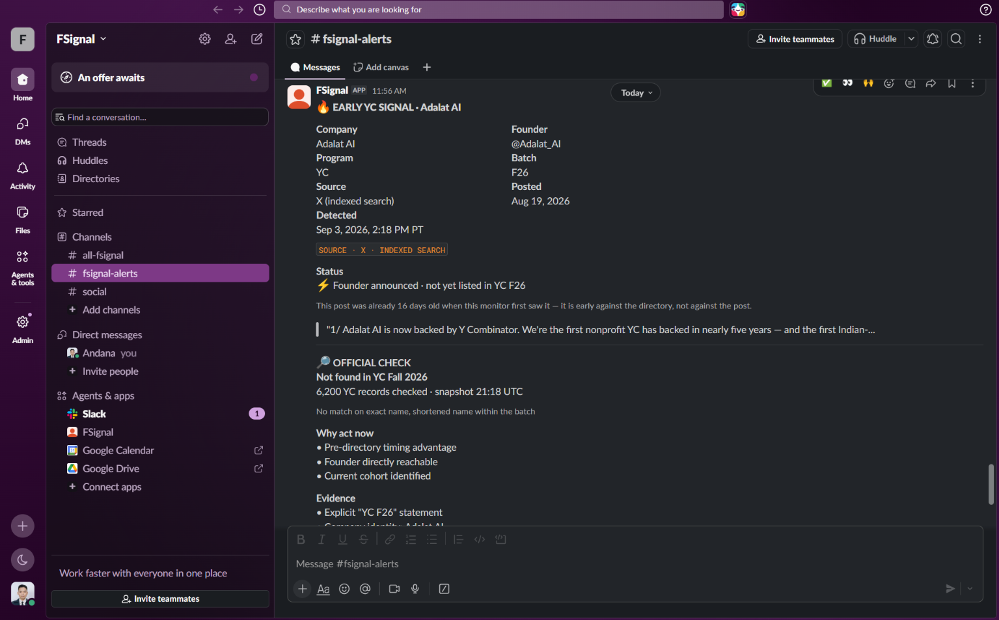
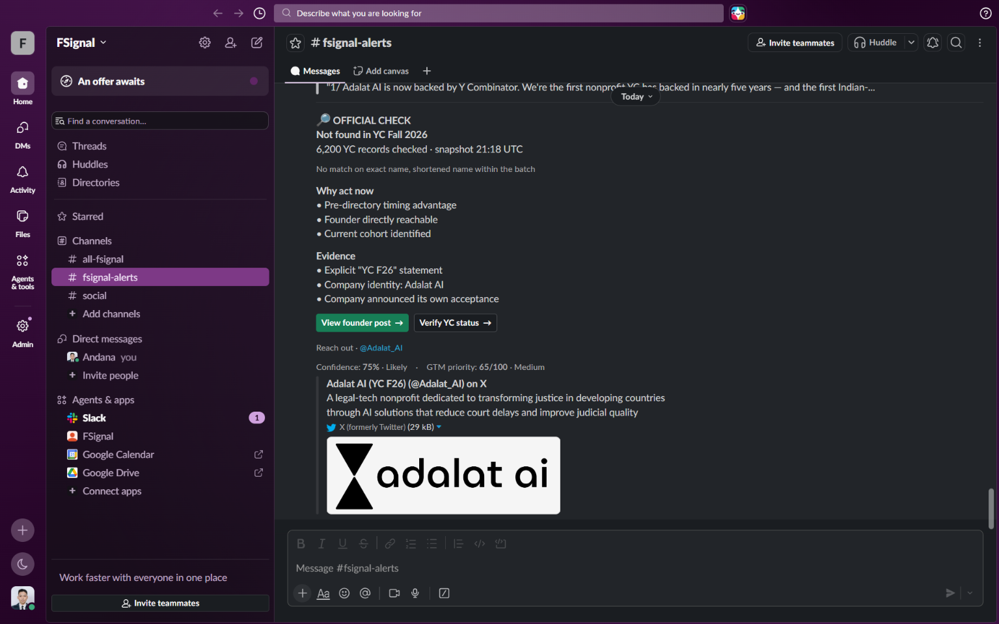

# FSignal

**[🚀 VIEW LIVE DASHBOARD (FSignal Radar)](https://fsignal-production.up.railway.app)**


A persistent Slack monitor that finds Y Combinator and a16z Speedrun founders **before
the official directory lists them** — and proves the claim on every alert.

A normal directory watcher tells you what has already been published. FSignal is built
around the earlier moment: the founder has announced acceptance publicly, but the
directory has not caught up. The hard part is not finding posts that mention YC; it is
knowing which of them are genuinely early. So every EARLY alert carries a receipt:

> 🔎 **OFFICIAL CHECK**
> **Not found in YC Fall 2026**
> 6,200 YC records checked · snapshot 21:18 UTC
> *No match on exact name, shortened name within the batch*

Every alert links straight to the directory search that proves it, so you can check it yourself in about ten seconds. Everything the bot rejects
is recorded too, with a reason — see `/ledger`.


## Proof of Functionality

FSignal successfully intercepts real Ghost Signals before they are listed in the official directory.


*Delivered to a real workspace: who, from where, in which batch, and the founder's own
words. `Source: X (indexed search)` names the path the signal actually came from — an
indexed result is never dressed up as a native one.*


*The receipt: **6,200 YC records checked**, snapshot timestamped, and the match rules that
found nothing. The two buttons open the founder's post and the directory search that backs
the claim.*


*The same search, run against `ycombinator.com/companies` filtered to Fall 2026: **"Sorry,
no matching companies found"**. The alert's claim, checked independently, in about ten
seconds.*

> Earlier captures of these alerts are in
> [`docs/proof/archive/`](docs/proof/archive/), unedited, with a note on what each one
> shows that has since been fixed. Deleting the *before* is how a fix stops being
> checkable.

## How it works

```text
YC Directory ─┐
Speedrun ─────┴─→ complete official snapshot (size + timestamp)
                            │
X / LinkedIn ──→ identity gate ──→ scoring ──→ official check ──→ EARLY / already-listed
                     │                              │                    │
              suppression ledger              persisted receipt      Slack alert
                                                                          │
                            company later appears officially → CONFIRMED + lead time
```

### The four sources

Each is a separate adapter on its own schedule, and each reports its own health and
retrieval path at [`/health`](https://fsignal-production.up.railway.app/health).

| Source | Implemented in | How it is read | Every |
|---|---|---|---|
| YC Directory | `app/sources/official.py` · `YCDirectorySource` | The public Algolia index the site's own JavaScript queries | 60 min |
| Speedrun | `app/sources/official.py` · `SpeedrunSource` | a16z's first-party API, the one `speedrun.a16z.com` calls itself | 120 min |
| X | `app/sources/social.py` · `XSource` | X recent search where a paid plan exists, otherwise publicly indexed X URLs — labelled either way | 240 min |
| LinkedIn | `app/sources/social.py` · `LinkedInSource` | Publicly indexed post URLs | 240 min |

**Official snapshot.** `ycombinator.com/companies` is a client-side Algolia application;
FSignal uses the same public search key the page hands its own JavaScript. A single
Algolia query caps at 1,000 hits, so a full crawl enumerates the `batch` facet and pulls
one slice per batch — **6,200 of 6,200 companies in about 8 seconds**. Between full
crawls, one recent-window query against the launch-date index catches new listings.
Speedrun uses a16z's own first-party API, the one `speedrun.a16z.com` calls itself.

> **On "YC Speedrun".** The brief names a *YC* Speedrun page. There is no such program:
> the public, distinct Speedrun company directory is **a16z Speedrun**, and that is what
> FSignal monitors — as a separate source, on its own schedule, with its own
> `SPEEDRUN` badge on every alert, exactly as the brief asks. It is tagged a16z rather
> than YC because that is who runs it, not because a source was substituted.

**Targeting.** Search terms are derived from whichever batches the directory reports as
currently filling, not hardcoded. A batch that is fully published cannot produce an early
signal, so hunting one is worse than not hunting. When Winter 2027 opens, the queries
retarget with no code change.

**Identity gate.** A candidate must yield a defensible company identity — a parenthesised
program tag like `Orca Aerospace (YC F26)`, a claim like `Structured AI is backed by Y
Combinator`, or `our company <Name>` — and survive a disqualifying-context check
(application deadlines, rejection posts, demo-day recaps, alumni threads, recruiter posts,
investor commentary). Anything that fails is ledgered with a reason and never alerted.

**Official check.** Domain first, then exact normalized name, then a batch-scoped strict
token-prefix so `Nodus` resolves to `Nodus Compute` while `Shepherd (YC S26)` does not
match the unrelated `Shepherd (Winter 2021)`. Last, a batch-scoped handle comparison,
because X names companies by handle: `@speko_ai` is the directory's `Speko`, and comparing
those as *names* says they are different companies — which is how an already-listed company
gets announced as an early discovery. Never fuzzy similarity, and both the prefix and
handle rules are confined to the batch the post itself claims, so neither can reach across
cohorts. If the snapshot is stale, the verdict is `possible`, never `early`.

**Dedup.** One alert per company, not per post. A second independent source for the same
company replies in the original Slack thread as corroboration.

## Measured behaviour

### How early is "early"?

The product is judged on lead time, so it is measured rather than asserted. A backtest
replays the live queries, extraction and matching against YC's *own published*
`launched_at`, for the batches the monitor is currently hunting
([`evidence/raw/lead-time-backtest.json`](evidence/raw/lead-time-backtest.json)):

| | |
|---|---|
| Companies resolved to a published listing time | 17 |
| Founder posted **before** YC listed them | 10 |
| Median lead | **4.4 days** |
| Mean lead | 15.3 days |
| Longest lead | **50 days** (screenpipe) |
| Ahead by a week or more | 5 |

The other 7 posted *after* YC listed them; they are reported, not averaged away. The
search index dates posts to the day, so each figure is ±1 day, and ranking means this is
a sample of the posts that existed rather than all of them. Both caveats are recorded in
the artifact itself.

### Precision

On 139 real captured Serper results for public LinkedIn posts
(`tests/fixtures/linkedin_corpus.json`, replayable offline):

| | |
|---|---|
| Candidates evaluated | 139 |
| Suppressed, each with a reason code | 106 |
| Correctly identified as already listed | 30 |
| Alerts raised | 3 |
| Alerts naming a real company | 3 / 3 |

`tests/test_precision.py` enforces precision ≥ 90% and a noise budget of at most one
non-actionable alert per twenty, in CI, against that fixture.

## Status at a glance

What is running, what is merely written, and what is running in a reduced mode. The
distinction matters more than the tick marks: *implemented* and *verified live* are not
the same claim, and a reader should not have to work out which one they are reading.

| | Status | |
|---|---|---|
| YC Directory monitoring | **verified live** | Full facet-sliced crawl, `mode: full` at `/health` |
| Speedrun monitoring | **verified live** | a16z first-party API, `mode: canonical` |
| LinkedIn monitoring | **verified live** | Indexed public posts |
| X monitoring | **fallback active** | Native path implemented; the reference deployment runs `indexed_fallback` because its account has no paid X plan |
| Persistent stateful monitoring | **verified live** | SQLite on a mounted volume, dedup enforced by DB constraint |
| Early detection | **verified live** | A real EARLY alert delivered, with the directory search that backs it |
| Slack delivery | **verified live** | Durable outbox, bounded retry, dead-letter |
| Slack interactivity | **verified live** | Signed requests accepted, replays and forgeries refused, on the reference deployment. Your own install needs the one manual step in Setup |
| Pond Protocol V1 | **deployed** | Manifest, authenticated runs and idempotency, exercised against the live URL |
| Ghost → Confirmed lead time | **backtested** | Measured against YC's published launch times; no live confirmation has occurred yet on this deployment |
| Lead-endpoint auth | **implemented, off** | `DASHBOARD_TOKEN` gate ships empty so the evidence stays checkable |
| Multi-tenancy | **not applicable** | Single-workspace personal bot, as the brief specifies |
| Real-time delivery | **limitation** | Polling, not push. Latency is bounded by the interval |

## Setup

> **New to Python or the terminal? Read [`docs/INSTALL.md`](docs/INSTALL.md) instead.**
> Same result, every click spelled out, Windows and macOS both covered, with a
> troubleshooting table keyed to the exact errors you might hit.

Requires Python 3.12+ (or Docker) and a Slack workspace where you can install an app.
Two credentials are enough to run everything: a Slack bot token and a Serper key.

```bash
python -m venv .venv && source .venv/bin/activate   # Windows: .venv\Scripts\activate
pip install -r requirements.txt
cp .env.example .env          # three lines marked >>> REQUIRED <<<
python -m uvicorn app.main:app --port 8000
```

Or `docker compose up -d`, which mounts `./data` so state survives restarts.

### Slack (required)

1. Create an app at [api.slack.com/apps](https://api.slack.com/apps) — you can upload
   `slack-app-manifest.yml` directly.
2. **OAuth & Permissions** → add the `chat:write` bot scope → install to your workspace.
3. Invite the bot to your channel: `/invite @FSignal`.
4. Copy the channel ID (right-click the channel → View channel details) and the bot token
   (`xoxb-…`) into `SLACK_CHANNEL_ID` and `SLACK_BOT_TOKEN`.

### Slack interactivity (one minute, worth doing)

Every alert ends in two navigation buttons — the founder's post, and the directory search
that backs the claim. They open their links either way, but until Slack has somewhere to
acknowledge the click it stamps the message *"This app is not configured to handle
interactive responses"*, which is a warning triangle on the one message built to be
trusted.

1. **Interactivity & Shortcuts** → toggle **Interactivity** on.
2. **Request URL**: `https://<your public base>/slack/interactions` — for the reference
   deployment that is `https://fsignal-production.up.railway.app/slack/interactions`.
   It must be public HTTPS; Slack will not accept `localhost`.
3. **Basic Information → App Credentials → Signing Secret** → copy into
   `SLACK_SIGNING_SECRET`, then restart.

The endpoint runs no business logic. It verifies Slack's HMAC signature in constant time,
refuses anything older than five minutes so a captured request cannot be replayed, and
answers `200`. With no secret configured it answers `503` rather than trusting an unsigned
caller. `/health` reports `slack_interactions_configured` so you can see which state a
deployment is in.

The manifest deliberately does not declare this: Slack requires a Request URL alongside
it, and that URL is your deployment, not one that belongs in a public repo.

### Search provider (required)

Neither X nor LinkedIn offers unrestricted public post search on a free plan, so both
social sources read *publicly indexed* URLs through [Serper](https://serper.dev) rather
than scraping authenticated pages. Create a key and set `SERPER_API_KEY`; the free tier is
enough. Results cap at 10 per query, which is why the bot issues one query per active
batch rather than one combined query.

*Want it faster than the shipped 4-hour social cadence?* The directories already run
hourly; the founder-post half is limited by the search index, not by the polling. The
three tiers that close that gap — and the one that is impossible — are set out in
[`docs/ROADMAP.md`](docs/ROADMAP.md#getting-to-real-time).

### X (optional — improves the X source, does not enable it)

X's own recent search carries metadata indexed search cannot: author bio, profile URL, and
the exact post timestamp. FSignal prefers it whenever it is reachable. **It is not on the
free tier** — without a paid plan the API answers `402 credits depleted`.

So the X source has two paths. Native first; on a billing block or a missing token, the
same vocabulary runs against indexed public X URLs using the Serper key above. Which path
answered is never hidden: `/health` reports `mode` per source, the mode is persisted on
every signal, and Slack renders `Source: X (indexed search)` when the alert came from the
fallback. An indexed result is never presented as a native one.

Set `X_BEARER_TOKEN` if you have a paid plan. Leave it empty otherwise — the source works
either way.

**What the reference deployment is actually running:** the indexed fallback,
`mode: "indexed_fallback"` in [`/health`](https://fsignal-production.up.railway.app/health),
because the account behind it has no paid X plan. The native path is implemented and
preferred, and it is not what you are looking at. Alerts from that deployment say
`Source: X (indexed search)` for the same reason. The practical difference is metadata and
latency, not coverage: indexed results carry a post's date to the day rather than the
hour, which is why the lead-time figures above are ±1 day.

### Pond (optional)

Set `POND_ACCESS_KEY` and `PUBLIC_BASE_URL` on a public HTTPS deployment, then publish the
agent with that base URL. See `docs/POND.md`.

## Verifying it works

```bash
python scripts/preflight.py     # which credentials are still missing
pytest -q                       # full suite, no credentials needed
python scripts/scan_once.py     # one real scan against live sources
python scripts/send_test_alert.py   # one real Slack message
```

Then open `/health` (source health, snapshot sizes, ledger counts), `/ledger` (every
candidate and its verdict), and `/signals/{id}/timeline` (one signal's full history).

### Offline replay — re-derive the numbers yourself

```bash
python scripts/replay_corpus.py            # or --json for a machine-readable summary
```

One command, no credentials, no network, no API spend. It resets its own database and
replays the 139 committed candidates through the *unmodified production pipeline* —
the same extraction, scoring, matching, dedup and alert code the deployment runs. Nothing
is hand-fed and no timestamp is invented.

It prints what the corpus produced and then runs the identical batch a second time, which
must add nothing: that is the dedup claim demonstrated rather than asserted.

```
139 candidates evaluated  →  106 suppressed · 30 already listed · 3 alerted
second pass: 0 new signals, 0 new alerts
```

`tests/test_offline_replay.py` runs it in CI with the socket layer removed underneath, so
"offline" is enforced rather than promised. Add `python scripts/demo_server.py` afterwards
to browse the result at `/ledger`.

This is a rehearsal, not proof of live delivery; for that, see [`evidence/`](evidence/).

## Adding a source

A source needs a `name` and an async `collect()`. Nothing else changes — extraction,
scoring, matching, persistence, dedup, Slack and Pond all sit downstream of that boundary.
See [`docs/ARCHITECTURE.md`](docs/ARCHITECTURE.md).

## Documentation

| | |
|---|---|
| [`docs/INSTALL.md`](docs/INSTALL.md) | The click-by-click setup, for someone who has never used Python |
| [`docs/ARCHITECTURE.md`](docs/ARCHITECTURE.md) | How the pipeline fits together, and where a new source plugs in |
| [`docs/POND.md`](docs/POND.md) | The Pond Protocol V1 endpoints, envelope validation and idempotency |
| [`docs/ROADMAP.md`](docs/ROADMAP.md) | What it would take to get to real time, including the tier that is impossible |
| [`docs/EVIDENCE.md`](docs/EVIDENCE.md) | What each captured artifact establishes, and how to re-derive it |
| [`evidence/`](evidence/) | The artifacts themselves, each carrying the URL and moment it came from |

## What this is built for

One person, one workspace, running continuously — which is what the brief asks for, and
what the design is honest about being. State survives restarts, alerts survive a Slack
outage, and a failing source degrades to a labelled fallback rather than going dark. That
is the bar it meets.

It is deliberately **not** a multi-tenant service. There is one database, one Slack
channel, and one configuration; every caller of `list_ghosts` sees the same operator's
signals. Serving several buyers their own private pipelines is a different architecture —
per-tenant isolation and a scheduler that is not process-local — not a patch on this one.
The limits below are the shape of that decision, not oversights in it.

## Known limitations

- **The lead endpoints ship open, and closing them is one variable.** The dashboard,
  `/ledger` and `/signals/{id}/timeline` carry the companies themselves, so on a public
  deployment they carry your pipeline. Setting `DASHBOARD_TOKEN` closes all three behind
  `Authorization: Bearer …` (or `?token=…`, since these are pages a person opens in a
  browser). It ships empty on purpose, because the evidence in this repo is only
  checkable while a reader can open the deployment it came from — `/health` reports
  `lead_endpoints_protected` either way. `/health` itself and the Pond endpoints are
  never gated: the first carries counts rather than companies, and the second is how Pond
  health-checks the agent.
- **Nothing watches the watcher.** `/health` reports source health, retry state and
  snapshot age, but nothing pages anyone when the process dies. Point an uptime check at
  it if the alerts matter.
- **The Serper allowance runs out, and both social sources go dark when it does.**
  At the shipped cadence the two of them issue about 90 queries a day (15 per run, six
  runs each), and the free allowance is a one-time grant rather than a monthly one — so
  it lasts on the order of a month, then X and LinkedIn start failing. The failure is
  loud: `/health` turns the source unhealthy and the scheduler backs off. Top the key up,
  or widen `X_SCAN_INTERVAL_MINUTES` and `LINKEDIN_SCAN_INTERVAL_MINUTES`, or drop
  `ACTIVE_BATCH_COUNT` to 1 — query volume scales with the number of batches hunted.
- **Polling, not push.** Latency is bounded by the polling interval; there is no webhook.
- **LinkedIn is index-limited.** Discovery depends on Google having indexed the post, so
  the true lead time is worse than X's would be. Serper's free tier returns 10 results per
  query.
- **X requires a paid plan.** See above.
- **X recent search only reaches back 7 days.** An outage longer than that leaves a gap
  the `since_id` watermark cannot recover.
- **SQLite, single worker.** The scheduler is process-local, so run one uvicorn worker and
  keep the database on persistent storage. Postgres is the upgrade path, not a need here.
- **The identity gate prefers precision.** Announcements that name no company ("we got
  into YC!") are recorded as suppressed rather than alerted. That is deliberate.

## Security

`.env` is gitignored and excluded from the Docker build context; the image never contains
it. Rotate any credential that has been in a working tree.
